# design-styles · 网页设计风格 Skill 合集

一套给 AI 编码助手（ZCode / Claude Code 等）用的**网页设计风格选择器**：内置 13 套风格鲜明、可直接落地的完整设计语言。装好之后，你对 AI 说「帮我做个官网」，它会先弹风格菜单让你选；选中的风格自带 12 条铁律、完整设计 token 和一个零构建示范模板。

7 套为当代网页设计语言（瑞士、玻璃拟态、孟菲斯、波普、粗野主义等），5 套为**设计史上由著名设计师开创的正典风格**——Art Deco（Cassandre、1925 巴黎博览会）、De Stijl（Mondrian、Rietveld）、俄国构成主义（Lissitzky、Rodchenko）、Mid-Century Modern（Paul Rand、Saul Bass）、迷幻海报（旧金山 Fillmore 学派 Big Five）；另有 1 套 **anthropic 纸感编辑部**——从 Claude/Anthropic 官网实机渲染页面提取全部设计 token 后复刻的当代「calm tech」标杆。

灵感来自瑞士国际主义（International Typographic Style）的方法论：**无衬线、左对齐、客观、网格驱动**——然后把同样的「可执行规范」思路扩展到另外 11 种气质完全不同的风格。

## 风格菜单

| 风格 | 气质一句话 | 典型场景 | 预览 |
|---|---|---|---|
| **swiss** 瑞士国际主义 | 网格、无衬线、左对齐、冷静高级 | 品牌官网、SaaS、作品集、年报 | 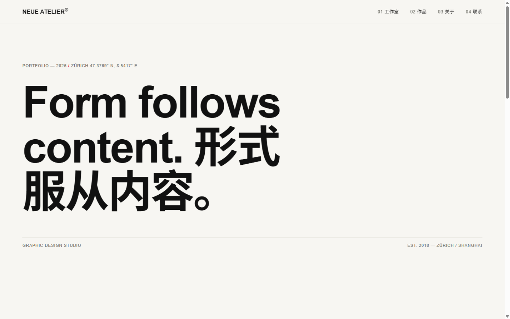 |
| **japandi** 日式侘寂 | 极端留白、明朝体、自然肌理的慢 | 茶/酒/旅馆/匠人品牌、文化机构 | 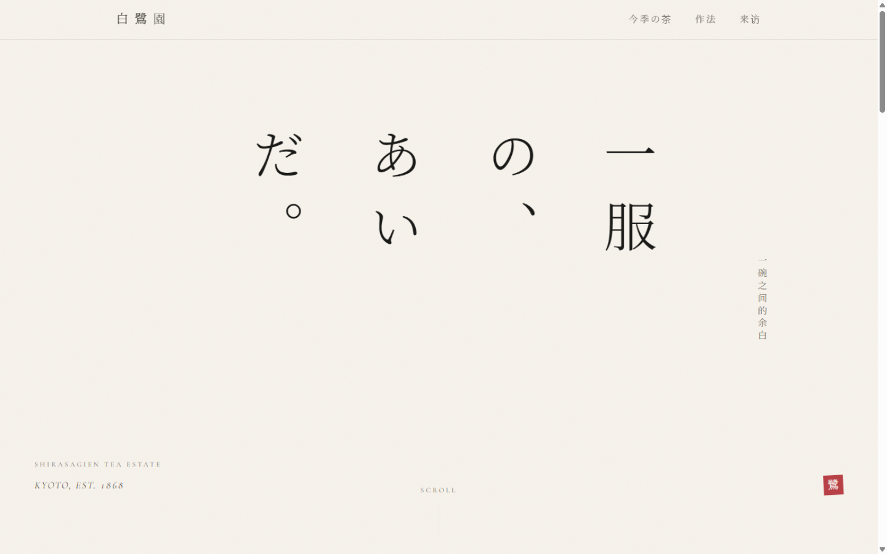 |
| **anthropic** 纸感编辑部 | 暖纸底、衬线叙事、墨色 10% hairline、clay 点缀 | AI 产品、研究机构、写作工具、出版物 | 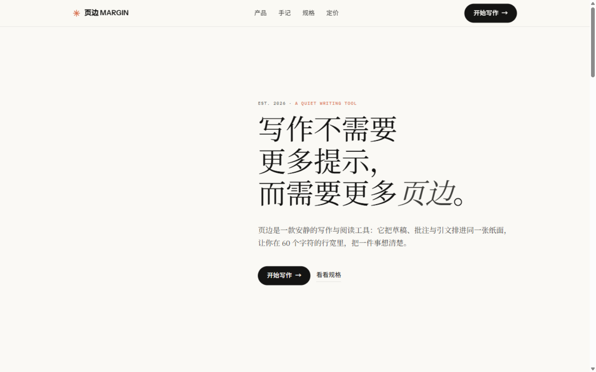 |
| **art-deco** 装饰艺术 | 对称的几何奢华：深底、金线、阶梯与旭日纹 | 奢华酒店、爵士酒吧、珠宝、电影院 | 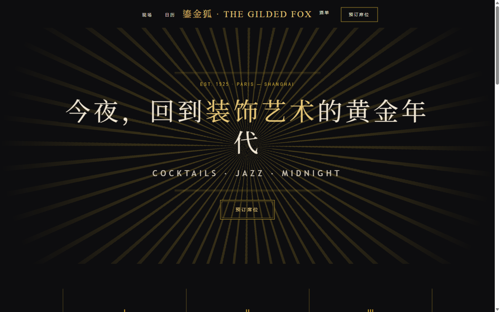 |
| **de-stijl** 风格派 | 贯通黑线 + 三原色格子的最小视觉语法 | 美术馆、基金会、家具与建筑品牌 | 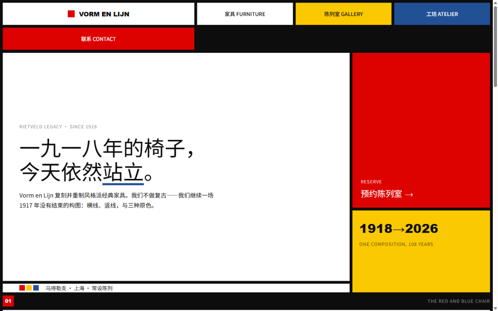 |
| **bauhaus** 包豪斯 | 几何三原色构成，图形即主角 | 设计院校、美术馆、文化机构 | 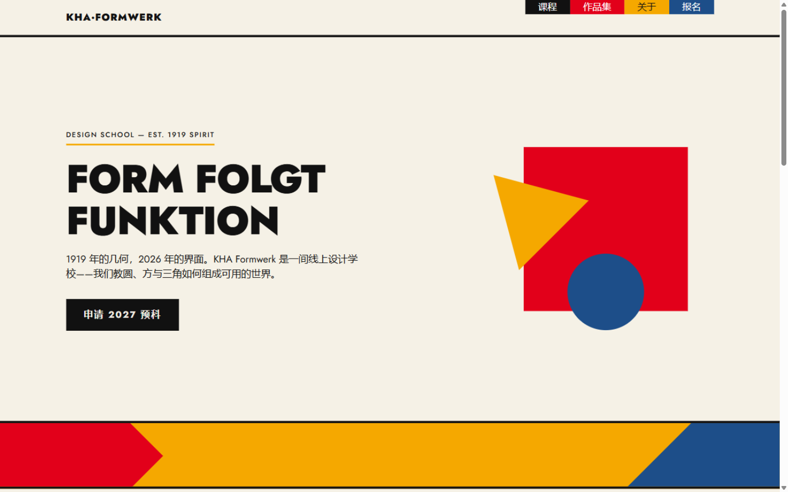 |
| **constructivism** 构成主义 | 红黑米白的对角动员令：楔形与口号 | 影展、出版市集、文化节、倡议活动 | 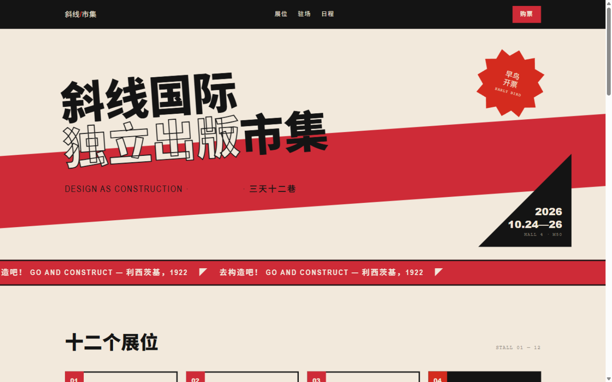 |
| **mid-century** 中古现代 | 原子时代的暖色符号学：blob、星芒、回旋镖 | 咖啡馆、唱片行、复古品牌、创意机构 | 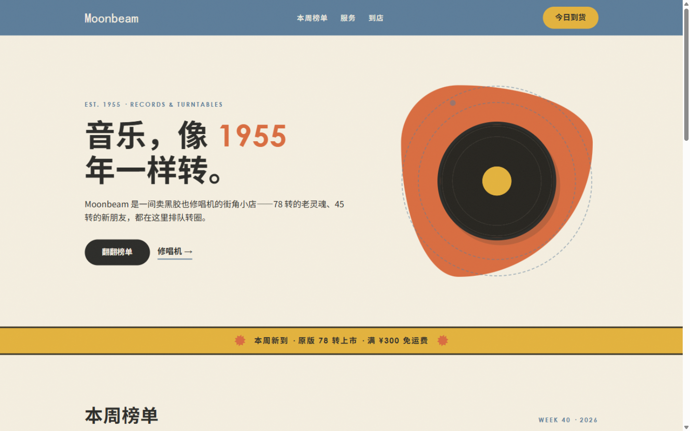 |
| **glassmorphism** 玻璃拟态 | 磨砂半透明 + 彩色光斑景深 | 音乐、天气、钱包等情绪化产品 |  |
| **memphis** 孟菲斯 | 80 年代形状词汇表派对 | 创意市集、青年品牌、活动页 | 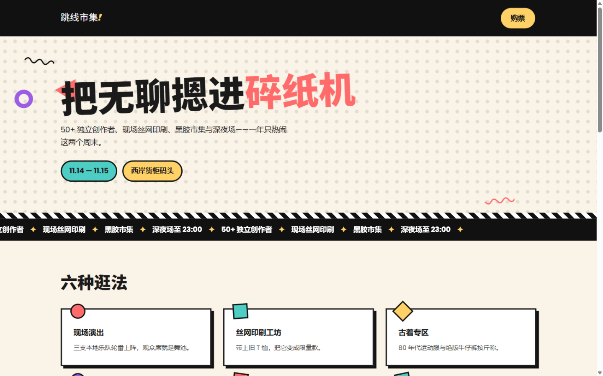 |
| **pop-art** 波普艺术 | 粗黑描边 + 高饱和撞色漫画 | 潮牌、饮料零食、音乐节、游戏 | 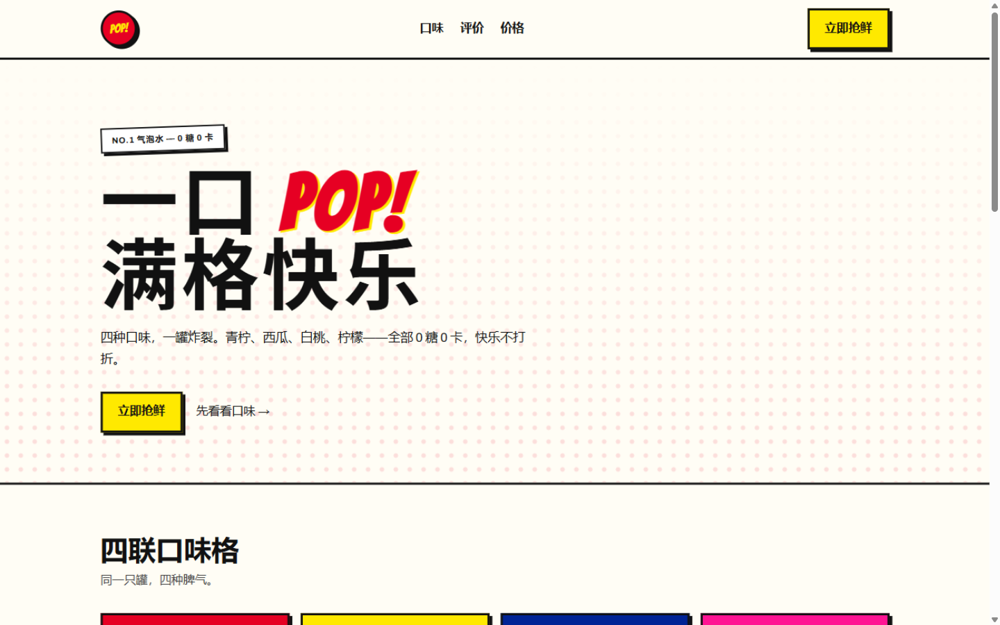 |
| **neubrutalism** 新粗野主义 | 硬边框硬阴影的贴纸朋克 | 开发者工具、创意工具、D2C | 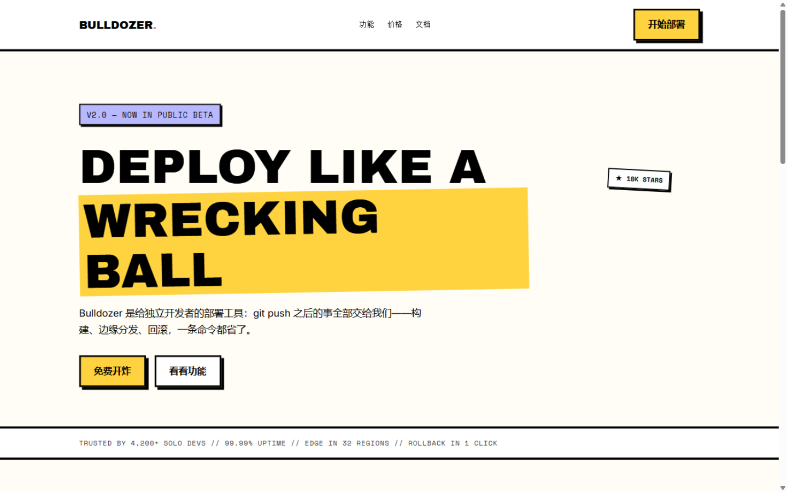 |
| **psychedelic** 迷幻海报 | 丝网平涂的振动与流动，信息层永远干净 | 音乐节、唱片店、艺术展、快闪 | 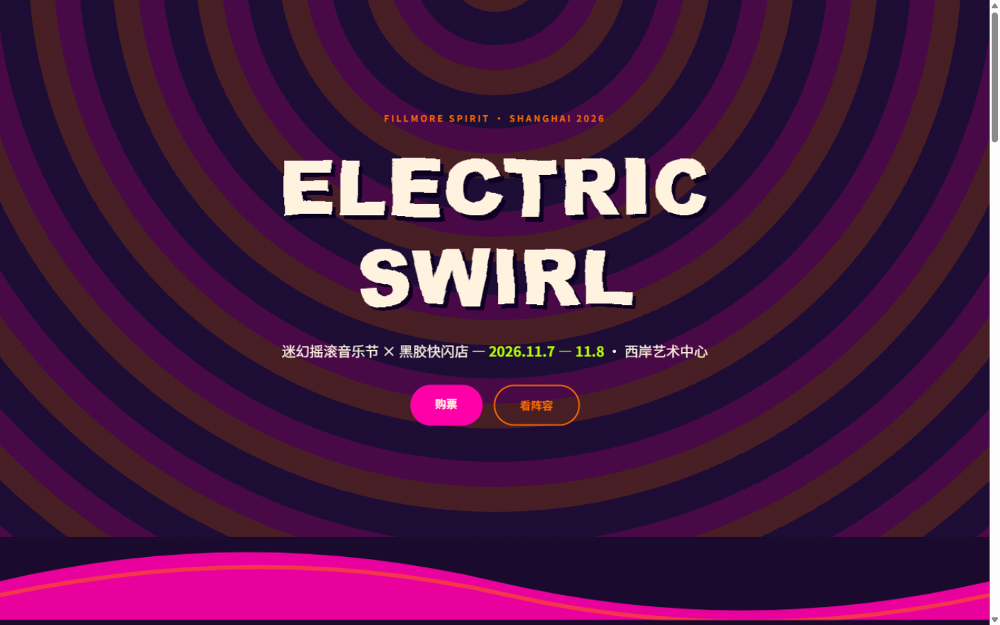 |

> 以上预览全部来自各风格 `assets/templates/` 示范模板的真实渲染截图（1440×900，Chrome）。

## 安装

把本仓库克隆到 AI 助手的用户级 skills 目录：

```bash
# ZCode / Claude Code（用户级，所有项目可用）
git clone https://github.com/5777-wq/design-styles.git ~/.agents/skills/design-styles

# Windows (PowerShell)
git clone https://github.com/5777-wq/design-styles.git "$HOME\.agents\skills\design-styles"
```

重启会话后，对 AI 说任意设计需求即可触发，例如：

- 「帮我做个咖啡品牌官网」→ 弹风格菜单 → 选 japandi
- 「用波普风格做个饮料落地页」→ 直接路由到 pop-art
- 「做个极简高级感的作品集」→ 推荐 swiss

## 每套风格包含什么

```
design-styles/
├── SKILL.md                  # 风格菜单 + 路由工作流
├── references/
│   ├── swiss.md … anthropic.md    # 13 份风格规范：本质 / 12 条铁律 / 设计 token / 工作流 / 自检清单
│   └── notes/                     # 18 份研究笔记：设计史、真实案例拆解、信息来源 URL
├── assets/templates/
│   └── swiss.html … anthropic.html   # 13 个零构建示范模板（单文件，浏览器直接打开）
└── docs/screenshots/              # 模板渲染截图
```

每份规范的核心是 **12 条可执行铁律 + 完整设计 token**（配色 hex、字体栈与 Google Fonts 引入、字阶、圆角/描边/阴影参数）+ **交付前自检清单**。研究笔记记录了每个规则的学理依据与真实网站案例（Vignelli Canon、Müller-Brockmann、Gumroad、Apple Liquid Glass、原研哉等）。

## 设计 token 速览

| 风格 | 配色 | 关键识别元素 |
|---|---|---|
| swiss | 纸白 `#F7F6F2` / 墨 `#111` / 瑞士红 `#E30613` | 12 列网格、hairline、编号系统 |
| japandi | 生成り `#F7F3EC` / 墨 `#26231F` / 臙脂 `#B94047` | 竖排落款、1px 细线、纸纹噪点 |
| anthropic | 象牙 `#FAF9F5` / 墨 `#141413` / clay `#D97757` | 边框=墨色10%透明度、衬线正文、mono 档案行 |
| art-deco | 午夜 `#0D0D0F` / 翡翠 `#0F5132` / 金线 `#D4AF37` | 严格对称、旭日纹 conic-gradient、双层 hairline |
| de-stijl | 红 `#DD0100` / 黄 `#FAC901` / 蓝 `#225095` / 黑白 | Grid gap 贯通黑线、彩块不相邻、面积即层级 |
| bauhaus | 红 `#E2001A` / 黄 `#F5A800` / 蓝 `#1D4E89` | Kandinsky 形色配对、45° 旋转、直角 |
| constructivism | 米白 `#F2E9DC` / 墨 `#141414` / 正典红 `#CE2B37` | 30° 对角红楔、蒙太奇套版错位、口号条 |
| mid-century | 奶油 `#F5EFE0` / 芥末 `#E3B23C` / 赤陶 `#D96C3F` | blob 8 值圆角、12 尖星芒、菜单点线 |
| glassmorphism | 深空紫蓝 `#0F0C29→#24243E` + 三色光斑 | `backdrop-filter: blur(20px) saturate(180%)` |
| memphis | 珊瑚红 `#FF6B6B` / 青 `#4ECDC4` / 黄 `#FFD166` | 3px 黑描边、`6px 6px 0` 硬阴影、形状词汇表 |
| pop-art | 纸白 `#FFFDF5` / 红 `#E60023` / 黄 `#FFE900` / 蓝 `#002395` | 3px 描边、本戴点、Bangers 拟声词 |
| neubrutalism | 米白 `#FFFDF5` / 黄 `#FFD23F` / 描边 `#000` | 2/3/4px 边框、`5px 5px 0` 硬阴影、等宽字体 |
| psychedelic | 深紫 `#1A0B2E` / 奶油 `#FFF3E0` / 品红 `#FF00A8` | Climate Crisis 融化字、SVG 位移滤镜、日落同心圆 |

## 如何新增一套风格

1. 在 `references/` 加 `<风格名>.md`（结构照抄现有规范：本质 / 铁律 / token / 工作流 / 自检）；
2. 在 `references/notes/` 加研究笔记（含信息来源）；
3. 在 `assets/templates/` 加 `<风格名>.html` 示范页；
4. 更新 `SKILL.md` 的菜单表。

## 说明

- 模板零依赖：仅通过 Google Fonts 加载展示字体（Bangers、Jost、Shrikhand、Archivo Black、Inter、Noto Serif SC 等，均为 OFL 授权），离线自动回退系统字体栈。
- 所有截图为本仓库模板的真实渲染，非效果示意图。
- 规范中的对比度、触控目标、`prefers-reduced-motion` 等无障碍底线适用于全部风格。

## License

[MIT](LICENSE)
